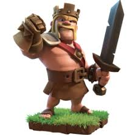

# Roles & Responsibilities

[[home]](../README.md)

## Clan

### Leader

- Leads general visionary direction of the clan.
- Ensure fairness within clan.
- Oversees the activities of the clan and it's activities.
- Oversees war events, and provides general direction, where necessary.

### Co-Leader

- Enforces the general visionary leadership of the clan Leader.
- Enforces the rules outlined.
- Assists with the general clan activities and war events.
- Entrusted to make decisions on behalf of the leader, for the betterment of the clan.
- Has overall experience.
- Is usually TH10+

### Elder

- Loyal member of the clan.
- Has been with the clan for sometime.
- Does not contain any of the leadership responsibilities.
- Has greater opinion of events, and general activities.
- Has general experience.
- Is usually TH8 to TH9

### Member

- New recruit of the clan.
- Has the least experience.
- Is usually TH1 to TH7

## Discord

### Administrator

- Has full server permissions.
- Maintains server and its various channels.

### Leader

- Has partially full server permissions.
- Able to create instant-invite links.
- Has priority speaker.
- Can send TTS (Text-to-speach) messages
- Can manage messages.
- Can mute members.
- Can defean members.
- Can move members.
- Can mention everyone.

### Co-Leader

- Has partially full server permissions.
- Able to create instant-invite links.
- Has priority speaker.
- Can send TTS (Text-to-speach) messages
- Can manage messages.
- Can mute members.
- Can deafen members.
- Can move members.
- Can mention everyone.

### Member

- Has the standard permissions to participate within discussions, and chat within channels.

### everyone

- Has spectator permissions.
- Cannot speak, nor send messages, within War Channels.
- Can send basic messages within Lobby.

[[home]](../README.md)
