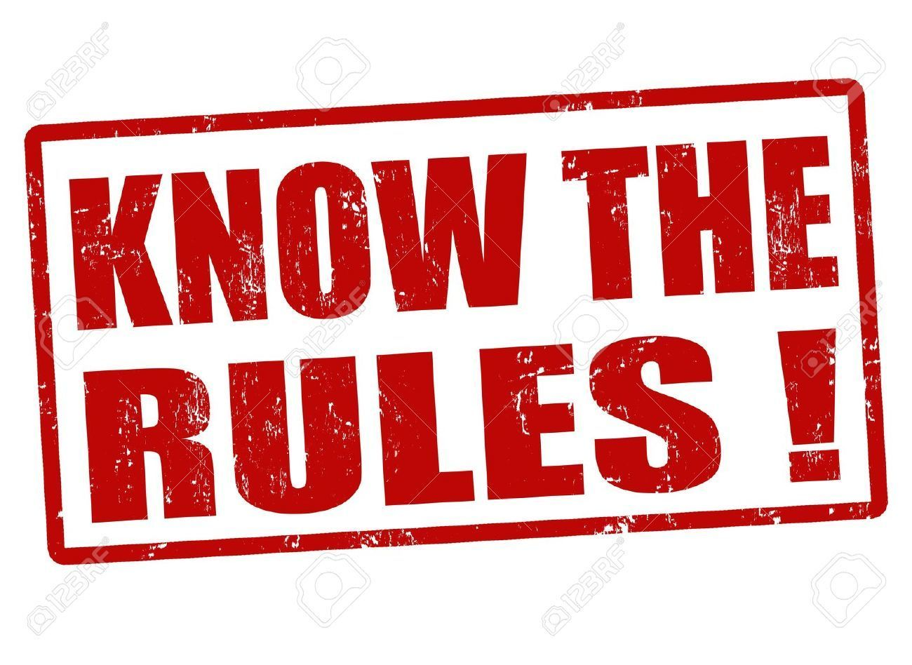

# Rules

[[home]](../README.md)

## General

- No sexism.
- No racism.
- No spamming.
- No hate speech.
- No excessive cursing.
- No social abuse.
- No self promoting.
- No negative behaviour.
- No drama.

## Clan

- Leader and Co-Leaders have the ultimate and final decision.
- Co-Leader decisions can be overridden by Leader.
- Donate what has been requested.
  - Do **NOT** take requesting as an opportunity to achieve dailies.

## War Games

- Participation is mandatory, unless exceptioned with good reason.
- A minimum of 1000 points is required of each member, even if the clan has reached the maximum number of points.

## Classic War & Clan War League (CWL)

- Do not waste attacks.
- Do not steal targets unless authorised.
- Do not favour loot, over the clan's victory.

## Discord

- No inappropriate or blank nicknames.
- No nicknames with glitched characters.
- No inappropriate messages or images
- No excessive loud noise in the voice channels.
- Don't use @ mods unnecessarily.
- Don't use the general chat to communicate with people in voice chats.
- Leader and Co-Leaders have the ultimate and final decision.

## Consequences

Violations of these rules may be met with:

- A warning
- A timeout
- A kick
- A ban

## Prohibitions

Prohibition is earned when violating any of the rules outlined by the clan, and repeated violations may lead to complete dismisal from the clan.

| Prohibition Count | Consequence                                                    |
|-------------------|----------------------------------------------------------------|
| 1st Offence       | 1 week denial into war, and the remainder of the current CWL.  |
| 2nd Offence       | 1 month denial into war, and the remainder of the current CWL. |
| 3rd Offence       | kicked from clan.                                              |

## Disclaimers

- If you foresee that you will **NOT** be able to participate within a war, please set your war preference settings to **I'm out**.
  - If your settings are set to **I'm in**, you will very likely be drafted for war.
- In the event to which you are drafted into war, but unforeseen circumstances befall you, please if possible inform the clan that you will not be able to commit your attack(s).
  - If this happens at regular intervals, then we will be forced to apply prohibition offenses accordingly. There is no harsh feelings towards individuals of these circumstances, yet we need to maintain fairness and consistency within the clan to allow a fair and enjoyable environment for all.

[[home]](../README.md)