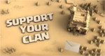
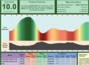

# Tools

[[home]](../README.md)

We make use of various tools to assist with **War** management, communication, and overall player and clan management.

## In Game Tools

### War Flag Calling

Please leave a flag of the enemy base to which you would like to claim, as well as the entry within **Clash Caller**.

### War Base Messages

If you have information that can be useful for other clan members, such as XBows being set for ground, please drop a message for someone to read. That message can prove to be useful when planning an attack strategy.

## Clash Caller

We make use of [Clash Caller](http://www.clashcaller.com/) to claim enemy target bases, while bearing in mind the [Time Slot](./attack-allocation-guidelines) affects.

This allows other members to see what has been claimed, and the results of member attacks.

For more information please see the following links:

- [Clash Caller](http://www.clashcaller.com/)
- [Clash Caller - Welcome](http://www.clashcaller.com/intro/welcome.html)
- [Clash Caller - Intro](http://www.clashcaller.com/intro/intro.html)
- [Clash Caller - Videos](http://www.clashcaller.com/intro/videos.html)
- [Clash Caller - About](http://www.clashcaller.com/intro/about.html)

## Clash of Clans Forecaster

[Clash of Clans Forecaster](http://clashofclansforecaster.com/)

This is not a necessary tool, but can prove useful for members to plan their raids for loot.

## Discord

We make use of Discord for our general communications, updates and information.

[[home]](../README.md)
